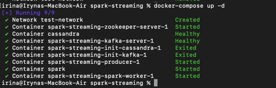
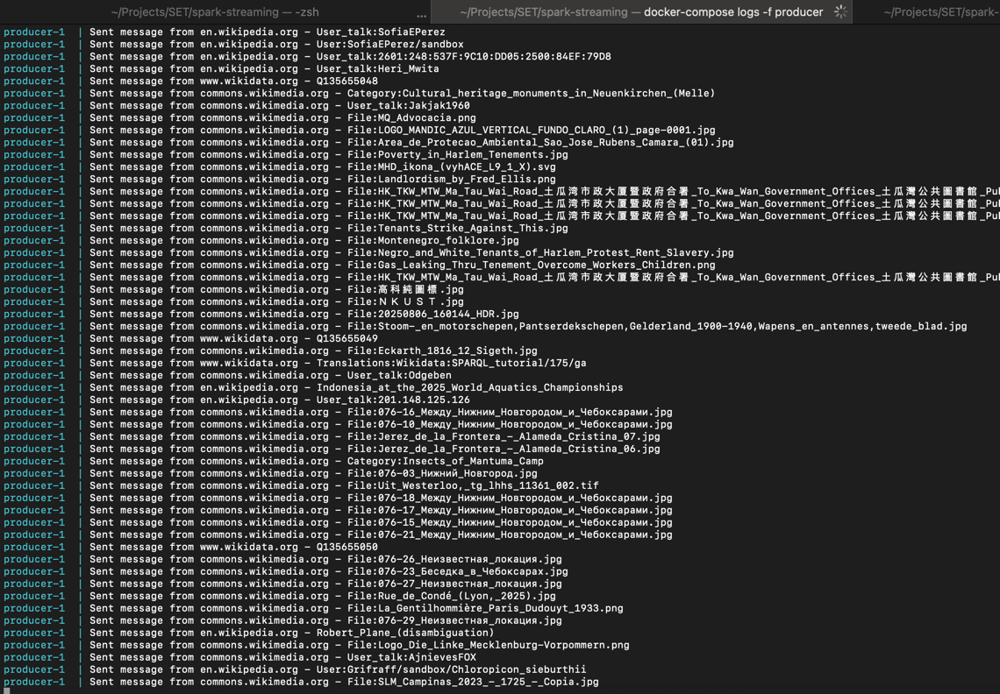
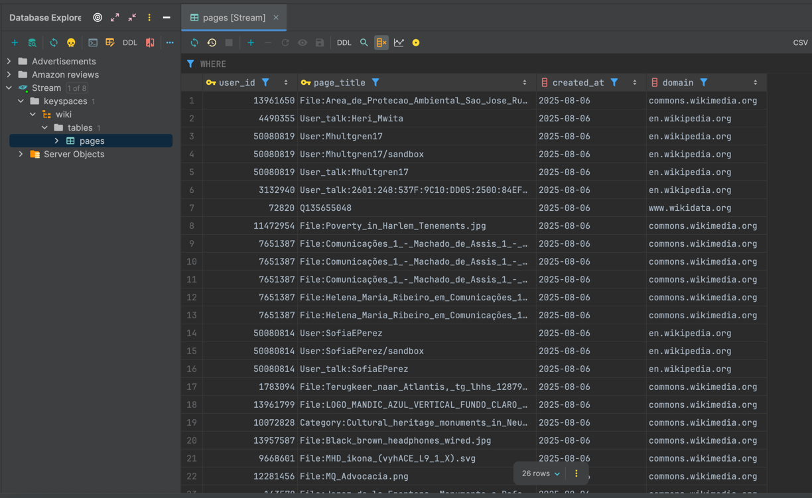
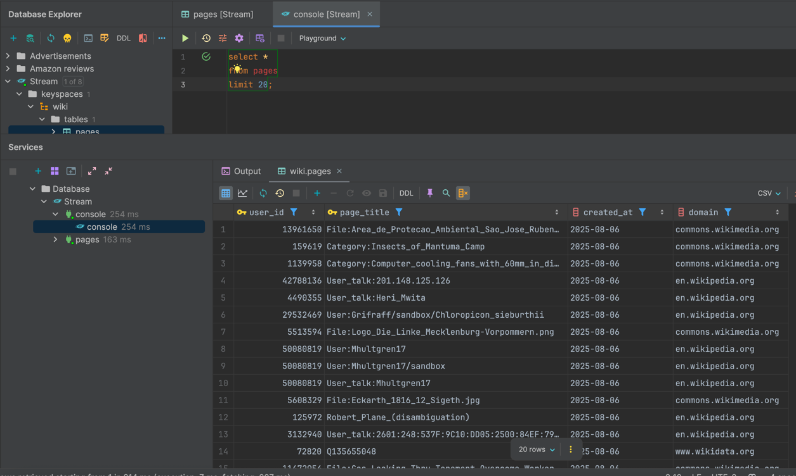

## How to run the app

### 1. Start Kafka, Zookeeper, Cassandra, Spark and producer
```bash
docker-compose up -d
```

### 2. Check producer logs
```bash
# View live producer logs
docker-compose logs -f producer
```

### 4. Stop the System
```bash
docker-compose down
```

### 5. Screenshots



